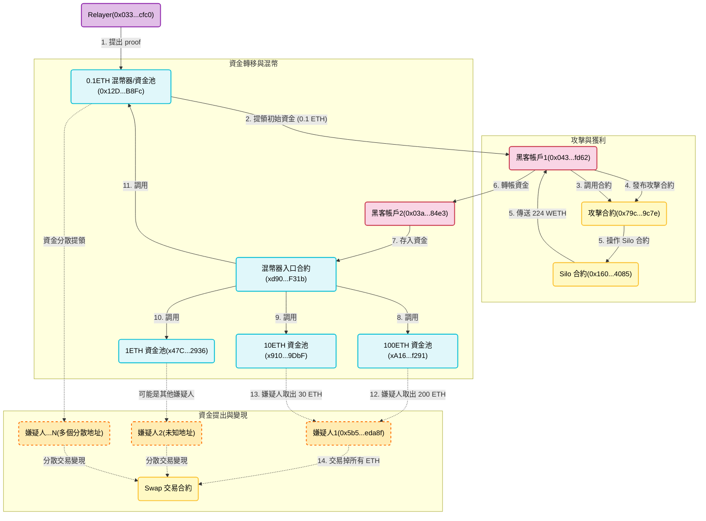

```mermaid
graph TD
    %% 定義節點樣式
    classDef hacker fill:#f9d5e5,stroke:#c83349,stroke-width:2px,color:#000;
    classDef mixer fill:#e0f7fa,stroke:#00bcd4,stroke-width:2px,color:#000;
    classDef contract fill:#fff9c4,stroke:#fbc02d,stroke-width:2px,color:#000;
    classDef relayer fill:#e1bee7,stroke:#8e24aa,stroke-width:2px,color:#000;
    classDef suspect fill:#ffecb3,stroke:#ff6f00,stroke-width:2px,stroke-dasharray: 5 5,color:#000;

    %% 定義實體節點
    Relayer("Relayer(0x033...cfc0)"):::relayer
    Mixer01("0.1ETH 混幣器/資金池(0x12D...B8Fc)"):::mixer
    Hacker1("黑客帳戶1(0x043...fd62)"):::hacker
    AttackContract("攻擊合約(0x79c...9c7e)"):::contract
    SiloContract("Silo 合約(0x160...4085)"):::contract
    Hacker2("黑客帳戶2(0x03a...84e3)"):::hacker
    MainMixerContract("混幣器入口合約(xd90...F31b)"):::mixer
    Pool100("100ETH 資金池(xA16...f291)"):::mixer
    Pool10("10ETH 資金池(x910...9DbF)"):::mixer
    Pool1("1ETH 資金池(x47C...2936)"):::mixer

    %% 嫌疑人與變現節點
    Suspect1("嫌疑人1(0x5b5...eda8f)"):::suspect
    Suspect2("嫌疑人2(未知地址)"):::suspect
    SuspectN("嫌疑人...N(多個分散地址)"):::suspect
    SwapContract("Swap 交易合約"):::contract

    %% 流程連接
    %% 準備階段
    Relayer --"1. 提出 proof"--> Mixer01
    Mixer01 --"2. 提領初始資金 (0.1 ETH)"--> Hacker1
    Hacker1 --"4. 發布攻擊合約"--> AttackContract

    %% 攻擊階段
    subgraph 攻擊與獲利
        Hacker1 --"3. 調用合約"--> AttackContract
        AttackContract --"5. 操作 Silo 合約"--> SiloContract
        SiloContract --"5. 傳送 224 WETH"--> Hacker1
    end

    %% 洗錢階段 - 存入
    subgraph 資金轉移與混幣
        Hacker1 --"6. 轉帳資金"--> Hacker2
        Hacker2 --"7. 存入資金"--> MainMixerContract
        MainMixerContract --"8. 調用"--> Pool100
        MainMixerContract --"9. 調用"--> Pool10
        MainMixerContract --"10. 調用"--> Pool1
        MainMixerContract --"11. 調用"--> Mixer01
    end

    %% 洗錢階段 - 提出
    subgraph 資金提出與變現
        Pool100 -."12. 嫌疑人取出 200 ETH".-> Suspect1
        Pool10 -."13. 嫌疑人取出 30 ETH".-> Suspect1
        Suspect1 -."14. 交易掉所有 ETH".-> SwapContract

        %% 新增多個嫌疑人示意 (使用虛線表示潛在金流)
        Pool1 -. "可能是其他嫌疑人" .-> Suspect2
        Mixer01 -. "資金分散提領" .-> SuspectN
        Suspect2 -. "分散交易變現" .-> SwapContract
        SuspectN -. "分散交易變現" .-> SwapContract
    end
```