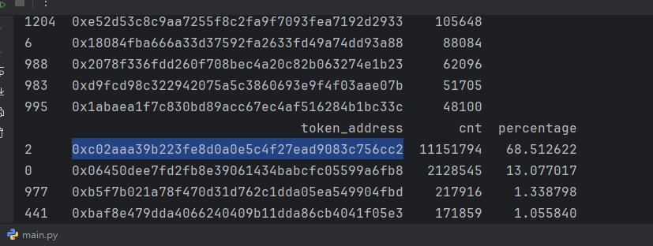

# GCP block chain analysis

鏈上數據分析

[https://decert.me/tutorial/MasteringChainAnalytics/](https://decert.me/tutorial/MasteringChainAnalytics/)

note:

### Q1

查出特定時間內被使用過的 erc20 合約，與使用次數

```bash
SELECT token_address, COUNT(*) FROM `bigquery-public-data.crypto_ethereum.token_transfers` WHERE (TIMESTAMP_TRUNC(block_timestamp, DAY) > TIMESTAMP("2025-11-01") AND TIMESTAMP_TRUNC(block_timestamp, DAY) < TIMESTAMP("2025-12-11")) group by token_address
```


基於分析

```bash
import pandas as pd

# read data.json
df = pd.read_json('data.json')
df.rename(columns={'f0_': 'cnt'}, inplace=True)
print(df.head())

# sort with cnt col
df.sort_values('cnt', ascending=False, inplace=True)
print(df.head(10))

total_count = df['cnt'].sum()
df['percentage'] = (df['cnt'] / total_count) * 100

print(df.head(10))
```



當前最紅的 erc20 確實是圖中地址: WETH 代幣

### Q2

題目: 分析 ETH 合約 **UniswapV3**

回答(查询30天內)

- 不同费率的流动资金池数量
- 按周汇总的新建流动资金池总数
- 每日新建流动资金池总数
- 统计资金池数量最多的代币Token
- 最新的100个流动资金池记录

在官網找到解說和地址:

https://gov.uniswap.org/t/official-uniswap-v3-deployments-list/24323

在 OKLink 做基本檢視

 https://www.oklink.com/zh-hant/ethereum/address/0x1f98431c8ad98523631ae4a59f267346ea31f984


核心概念是 `Uniswap` 合約可以創建流動性資金池

所以只要分析 ETH Event 中該合約創建資金池的 Event 即可

根據上圖可以得知合約事件的參數

- token0: event id
- token1: coin1 addr
- token2: coin2 addr

使用以下 query

```bash
SELECT
  block_timestamp AS block_time,
  topics[SAFE_OFFSET(1)] AS topic1,
  topics[SAFE_OFFSET(2)] AS topic2,
  topics[SAFE_OFFSET(3)] AS topic3,
  transaction_hash AS tx_hash
FROM
  `bigquery-public-data.crypto_ethereum.logs`
WHERE
  address = LOWER('0x1F98431c8aD98523631AE4a59f267346ea31F984')
  AND topics[SAFE_OFFSET(0)] = LOWER('0x783cca1c0412dd0d695e784568c96da2e9c22ff989357a2e8b1d9b2b4e6b7118')
  AND (DATE(block_timestamp) >= '2025-11-1' AND DATE(block_timestamp) < '2025-12-1')
```

得到 data

透過以下程式碼完成分析

```jsx
import pandas as pd

def process_ethereum_logs(file_path):
    # 1. 定義欄位名稱
    # 原始數據的 "block_time" 包含空格 (例如: 2025-11-24 22:18:11 UTC)
    # read_csv 遇到空格會切分，所以我們手動定義 date, time, tz 三個欄位來接住它
    cols = ['date', 'time', 'tz', 'topic1', 'topic2', 'topic3', 'tx_hash']

    try:
        # 2. 讀取 data.txt
        # sep=r'\s+' 表示以任意數量的空格或 Tab 作為分隔符
        # skiprows=1 表示跳過原本檔案裡的第一行標題 (因為我們要用自定義的 cols)
        df = pd.read_csv(file_path, sep=r'\s+', skiprows=1, names=cols)
    except FileNotFoundError:
        print(f"錯誤: 找不到檔案 {file_path}，請確認檔案位置。")
        return

    # 3. 輔助函數：清洗數據
    def decode_address(hex_str):
        # 處理可能的 NaN 或非字串情況
        if not isinstance(hex_str, str): return hex_str
        # 取最後 40 個字元 (20 bytes) 並補回 0x
        return '0x' + hex_str[-40:]

    def decode_int(hex_str):
        # 將 Hex 轉為十進位整數
        try:
            return int(hex_str, 16)
        except (ValueError, TypeError):
            return 0

    # 4. 應用轉換邏輯
    # 合併時間欄位
    df['block_time'] = pd.to_datetime(df['date'] + ' ' + df['time'])

    # 解析地址 (Topic1, Topic2)
    df['topic1_parsed'] = df['topic1'].apply(decode_address)
    df['topic2_parsed'] = df['topic2'].apply(decode_address)

    # 解析數值 (Topic3)
    df['topic3_decimal'] = df['topic3'].apply(decode_int)

    # 5. 整理最終輸出表格
    # 只選取處理好的欄位，並重新排序
    final_view = df[['block_time', 'topic1_parsed', 'topic2_parsed', 'topic3_decimal', 'tx_hash']]

    return final_view

# 執行主程式
if __name__ == "__main__":
    result_df = process_ethereum_logs('data.txt')

    # 不同费率的流动资金池数量
    q1_ret = result_df.groupby("topic3_decimal").count().reset_index()
    print(q1_ret.head(10))

    # 按周汇总的新建流动资金池总数
    q2_ret = result_df.copy()
    q2_ret['block_time'] = q2_ret['block_time'].dt.isocalendar().week
    q2_ret = q2_ret.groupby('block_time').count().reset_index()
    print(q2_ret.head())

    #每日新建流动资金池总数
    q3_ret = result_df.copy()
    q3_ret['date_str'] = q3_ret['block_time'].dt.strftime('%Y-%m-%d')
    q3_ret = q3_ret.groupby('date_str').count().reset_index()
    print(q3_ret.head())

    # 统计资金池数量最多的代币Token
    part1 = result_df[['tx_hash', 'topic1_parsed']].rename(columns={'topic1_parsed': 'token'})
    part2 = result_df[['tx_hash', 'topic2_parsed']].rename(columns={'topic2_parsed': 'token'})
    q4_ret = pd.concat([part1, part2], ignore_index=True)
    q4_ret = q4_ret.groupby('token').count().reset_index()
    print(q4_ret.sort_values("tx_hash", ascending=False).head(20))

    # 最新的100个流动资金池记录
    q5_ret = result_df.sort_values("block_time", ascending=False).head(20)
    print(q5_ret.head(20))
```

### Q3

**Lens Protocol 分析**

- 總用戶數量、
    - 總的創作者數量、
    - 創作者佔比等
- 總出版物數量
    - 總評論數量、
    - 總鏡像數量、
    - 總收藏數量等
- 用戶相關的分析：
    - 每日新增創作者數量、
    - 活躍創作者數量、
- Lens帳號個性化域名的相關分析：
    - 域名註冊數量、
    - 不同類型域名的註冊情況（純數字、純字母、不同長度）等
- 同一個地址創建多個Profile分析
- 帳號分析
    - 發帖最多的帳號數據分析

本題嘗試分析有 L2 chain 的 Lens，因為有 L2 chain，所以需要到官網查詢 L2 chain 內部資料如何取得

查詢官網得到 big query 搜索資料集

https://lens.xyz/docs/chain/tools/bigquery/introduction

以下是相關定義

https://lens.xyz/docs/chain/tools/bigquery/schemas

配合以下程式碼可以分析

[https://github.com/leon123858/python-scripts-exercise/blob/main/blockchain-data-science/q3.ipynb](https://github.com/leon123858/python-scripts-exercise/blob/main/blockchain-data-science/q3.ipynb)

### Q4 透過流動性合約計算實時 ETH 美元價值

取得 WETH9 合約的價格，

https://www.oklink.com/zh-hant/ethereum/address/0xc02aaa39b223fe8d0a0e5c4f27ead9083c756cc2/contract

為了得知真實價格，所以需要挑選美元穩定幣來比較 WETH

找到流動性合約為 WETH9 vs USDC/USDT 接著查看當下成交價即可

首先查到 USDC 地址 https://www.oklink.com/zh-hant/ethereum/address/0xa0b86991c6218b36c1d19d4a2e9eb0ce3606eb48

再來查到流動性合約: https://www.oklink.com/zh-hant/ethereum/address/0x5c69bee701ef814a2b6a3edd4b1652cb9cc5aa6f

調用合約查詢 WETH9 vs USDC 的合約地址: 0xB4e16d0168e52d35CaCD2c6185b44281Ec28C9Dc

https://etherscan.io/address/0x5C69bEe701ef814a2B6a3EDD4B1652CB9cc5aA6f#readContract


https://etherscan.io/address/0xB4e16d0168e52d35CaCD2c6185b44281Ec28C9Dc

最終查詢合約可以得知當下價格

https://etherscan.io/address/0xB4e16d0168e52d35CaCD2c6185b44281Ec28C9Dc#readContract


ETH = 10853624529211/3692552607797834291386=**2.93932834e-9**

價格合理，小數點後面是單位問題


所以我們透過該合約的每一次成交時的轉換可以得知每個時刻的 ETH 價格

要抓的是 swap event


ETH price = ret[0]/ret[3] + ret[2]/ret[1]

https://github.com/leon123858/python-scripts-exercise/blob/main/blockchain-data-science/q4.ipynb

### Q5

ERC20 的代幣分布

嘗試分析 Maxi Doge (MAXI) 這個**毗貅盤**的以下問題

basic

- 查询代币持有者数量和代币的总流通量
- 查询持有代币最多的地址
- 查询不同代币持有者的持有金额分布

advance

- 查询 coin 代币持有者数量随日期的变化情况

ANS

https://github.com/leon123858/python-scripts-exercise/blob/main/blockchain-data-science/q5.ipynb

### Q6

NFT (ERC-721) 數據分析 base on **`token_transfers`**

計算 https://etherscan.io/token/0x9e4ceA1ba3f1fdC80DD2b6CEb20628d03a1b1AEa 

地址 `0x9e4ceA1ba3f1fdC80DD2b6CEb20628d03a1b1AEa` in ETH

- **当前持有人数**
- **总token数量**
- **holder的分布**

ANS:

https://github.com/leon123858/python-scripts-exercise/blob/main/blockchain-data-science/q6.ipynb

### Q7

追蹤智能借貸 https://docs.compound.finance/#networks 一個月內的以下數據

**題目 A：鉅額清算分析 (The "Absorb" Event)**
Compound V3 的清算機制叫做 "Absorption" (吸收)，協議會把壞帳買下來。

- **目標**：找出過去一個月內最大的幾筆清算事件。

**題目 B：巨鯨行為追蹤 (User Position Health)**

- **目標**：監控某巨鯨在 Compound V3 上的進出

ANS:

https://github.com/leon123858/python-scripts-exercise/blob/main/blockchain-data-science/q7.ipynb

### Q8 ETH 幣流追蹤

參考 https://hacked.slowmist.io/?c=ETH&page=1

追蹤案件:  https://silofinance.medium.com/post-mortem-unreleased-leverage-contract-exploitd-0ab8f37afcbb

關鍵交易如下: https://www.oklink.com/zh-hant/ethereum/tx/0x1f15a193db3f44713d56c4be6679b194f78c2bcdd2ced5b0c7495b7406f5e87a

Ans:

https://github.com/leon123858/python-scripts-exercise/blob/main/blockchain-data-science/q8.ipynb

### Q9 TRON 幣流追蹤

參考: https://www.facebook.com/BlockTrend.today/posts/pfbid0cSTKnDohcKqKKkYykr7U3j6SLmkW9n9jxN42QhjMAUtuotrtb4dwtxr7k8NVQZxNl

> 
> 
> 
> 4/9 更新：[https://www.facebook.com/share/83soBt8hHrwETPom](https://www.facebook.com/share/83soBt8hHrwETPom)
> —
> 創意私房的金流高度仰賴加密貨幣，網站上也有公開的 TRON 收款地址。看起來創意私房收款者喜歡用 Trust Wallet，而且每隔一段時間就會換一組新地址收錢。以網址搭配網路時光機，就可以找到幾個創意私房使用過的收款錢包地址：
> 
> - TA2G85LLXqtbcMwwZUKn4gDdQ9EkoHRp8V（目前使用中）
> - TJxBDgdAmD1NPy6ih4E6RBM4YQWZRACakZ
> - TPbRDKYYi5qT3Ayutw6NV31bvNX9zGivZx
> - TUQbf1PgWvxKethbrYLFY842UL6Z41RiKC
> 有了錢包地址，就可以回頭追查金流。把錢包地址丟進 OKLink 區塊鏈瀏覽器，可以看到最近一筆收款就在剛剛，從幣安交易所轉了 298 USDT 進來。再往前捲動，就會發現各家交易所名稱都會出現。
> 這些就是目前仍持續購買創意私房會員的轉帳。我只能說，用加密貨幣來買創意私房會員實在是很大膽。因為每筆鏈上轉帳都有流水號（txid），交易所手上則有用戶資料。只要把兩個東西兜起來，不就知道誰是買家了嗎？
> 但抓到買家沒什麼用，創意私房的錢流向何方才是檢警追查的重點。幣流分析公司肯定有更進階的工具，但一般人可以使用區塊勢曾經介紹過的 MetaSlueth 看個大概。會發現創意私房的金流滿狡猾，不是一大筆直接送到某個中心化交易所帳戶。而是分許多小筆送到不同帳戶變現或是做其他用途。
> 但無論金額大小，成為創意私房收款者肯定是有牽連，不然哪會無緣無故收到錢呢？如果仔細查，可能又會抓到一些賣帳號的人頭。通常鏈上金流追到中心化交易所就已經是終點了，接下來的資訊從鏈上看不到，只能仰賴執法單位跟交易所合作。畢竟法幣金流網路上查不到。
> 寫這篇想說的是，外行人看到創意私房使用加密貨幣收款，就說：「你看加密貨幣隱蔽性很高，是犯罪、洗錢的工具。」殊不知，鏈上金流比其他銀行金流更透明得多，連我這種鍵盤仔都可以花個幾分鐘看到金流流向。
> 缺的是一套將鏈上金流與傳統犯罪防治系統接在一起的跨境聯防機制。雖然大家都能看到金流跑去哪些交易所變現，但要跨境聯繫執法單位、請交易所配合，卻是更耗時費力的工作。只有檢警調的資訊流跑的比創意私房的金流更快，才有機會一口氣人贓俱獲。

Ans:

https://github.com/leon123858/python-scripts-exercise/blob/main/blockchain-data-science/Q9.ipynb